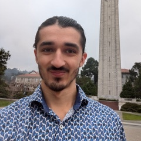

# About

The UBC/SFU Joint Statistics Seminar is jointly hosted by the graduate students of the [UBC Department of Statistics](https://www.stat.ubc.ca/) and the [SFU Department of Statistics and Actuarial Science](https://www.sfu.ca/stat-actsci.html). The Spring 2026 event is the second of two events taking place in the 2025/2026 academic year. The Fall 2025 event was organized by graduate students from SFU, and the Spring 2026 event is organized by graduate students from UBC. Over its 20-year history, the event has offered Statistics and Actuarial Science graduate and undergraduate students at both schools an opportunity to network with their peers and to attend accessible talks about the research work of their fellow students and faculty. 

The Spring 2026 event includes talks given by six students (three from UBC and three from SFU) and one faculty member from UBC.

Check out more events hosted by the [UBC Statistics Graduate Student Association](https://ubc-stat-grad.github.io/).

# Registration

This term's event will be hosted at **UBC's Earth Sciences Building (ESB 5104) on March 7, 2026**. The event starts at **10:00 am**. 
Register now through the [registration form](https://forms.gle/v7RBUT6gNNvSagcq8)! If you are interested in presenting,
please contact [Son](https://www.stat.ubc.ca/users/son-luu) or [Jessica](https://www.stat.ubc.ca/users/jia-ni-jessica-xu).

# Schedule

---

###  Breakfast  
####   10:00am - 10:30am 

---

###  Welcome Message  
####   10:30am - 10:35am 

---

###  Johnny Xi (UBC) 
####  10:35am - 11:00am 

<table cellspacing="0" cellpadding="0">
<tr><td width="50%" style="vertical-align:text-top">

</td><td>

<strong>Distinguishing Cause from Effect with Causal Velocity Models</strong>

Inferring causal relations from purely observational data is a challenging task due to the symmetry of statistical dependence. In the absence of cycles, it is well-known that even in multivariate settings that this symmetry collapses to an indeterminacy in bivariate causal directions: that is, determining whether X causes Y, or Y causes X. In the absence of experimental data, a common approach is to formulate prospective model classes for the underlying causal process, and conduct goodness-of-fit comparisons to infer the most likely causal direction. In this talk, we describe novel parametrizations of scalar-on-scalar causal models in terms of a causal velocity function, by viewing the cause variable as time in a dynamical system. Using tools from measure transport, we obtain a unique correspondence between the underlying velocity and the score function of the observational distribution, yielding a novel goodness-of-fit procedure based on non-parametric score estimation that extends beyond known model classes and requires no distributional assumptions. We present positive results in simulation and benchmark experiments where many existing methods fail, and perform ablation studies to examine the method’s sensitivity to accurate score estimation.

</td></tr>
</table>

---

###  Haiyi Shi (SFU) 
####  11:05am - 11:30am 

<table cellspacing="0" cellpadding="0">
<tr><td width="50%" style="vertical-align:text-top">

</td><td>

<strong>A short introduction to the stochastic inverse problem</strong>

This talk first introduces the concepts of inverse problems, using linear equations as a starting point. A primary challenge in these linear systems is ill-conditioning, which could severely undermine the solution accuracy. Then we formulate the Stochastic Inverse Problem (SIP), illustrated by some concrete examples. Finally, we explore a non-parametric Bayesian approach for solving SIPs and the problem of its ill-conditioning.

</td></tr>
</table>

---

###  Jack Farley (UBC) 
####  11:35am - 12:00pm 

<table cellspacing="0" cellpadding="0">
<tr><td width="50%" style="vertical-align:text-top">

</td><td>

<strong>A new approach to the forward-backward algorithm</strong>

A Hidden Markov Model (HMM) is a probabilistic model for sequential data consisting of a hidden discrete-state process and observations generated from state-dependent emission distributions. Due to their flexibility, HMMs are widely used in diverse fields such as ecology, econometrics, and natural language processing. Given a sequence of observations, the forward–backward algorithm computes the posterior marginal distributions of the hidden states. However, for long time series, it can be slow because it requires sequential forward and backward passes over the entire sequence. In this talk, I present a parallel-in-time reformulation of the forward–backward algorithm optimized for GPU architectures. This enables scalable smoothing for long sequences, which I will discuss in several application settings.

</td></tr>
</table>

---

###  Lunch 
####  12:00pm - 1:00pm 

---

###  Zikai Xu (SFU) 
####  1:00pm - 1:25pm 

<table cellspacing="0" cellpadding="0">
<tr><td width="50%" style="vertical-align:text-top">

</td><td>

<strong>P-Value Combination Under Sample Overlap: A Gamma Approximation Approach for GWAS
Meta-Analysis</strong>

Meta-analysis is a popular approach to combine results from multiple genome-wide association studies (GWAS) without sharing individual-level data. Large consortiums can meta-analyze dozens to hundreds of individual studies. For example, the HostSeq project is a Canadian initiative in which 15 clinical and epidemiological studies were assembled with DNA samples from ~10,000 Canadians infected by the SARS-CoV-2 virus. However, individuals might have been recruited into more than one study, which induces sample overlaps between studies and thus violates the common independence assumptions in standard meta-analysis approaches. To resolve this problem, we propose an adjustment to Fisher's method that explicitly corrects the correlation between the p-values to be combined. Our proposed method requires no individual-level data and minimal summary statistics from the overlapping samples. We demonstrate with simulation studies that our proposed method is accurate and has comparable power with mega analysis where all individual-level data are available. We further applied our method to partially overlapping studies in the HostSeq initiative.

</td></tr>
</table>

---

###  Naitong Chen (UBC) 
####  1:30pm - 1:55pm 

<table cellspacing="0" cellpadding="0">
<tr><td width="50%" style="vertical-align:text-top">

</td><td>

<strong>Coreset Markov chain Monte Carlo</strong>

A Bayesian coreset is a small, weighted subset of data that replaces the full dataset during inference in order to reduce computational cost. However, state of the art methods for tuning coreset weights are expensive, require nontrivial user input, and impose constraints on the model. In this work, we propose a new method—Coreset MCMC—that simulates a Markov chain targeting the coreset posterior, while simultaneously updating the coreset weights using those same draws. Coreset MCMC is simple to implement and tune, and can be used with any existing MCMC kernel. We analyze Coreset MCMC in a representative setting to obtain key insights about the convergence behaviour of the method. Empirical results demonstrate that Coreset MCMC provides higher quality posterior approximations and reduced computational cost compared with other coreset construction methods. Further, compared with other general subsampling MCMC methods, we find that Coreset MCMC has a higher sampling efficiency with competitively accurate posterior approximations.

</td></tr>
</table>

---

###  Break 
####  2:00pm - 2:10pm 

---

###  Prof. Saifuddin Syed (UBC) 
####  2:10pm - 3:10pm 

<table cellspacing="0" cellpadding="0">
<tr><td width="50%" style="vertical-align:text-top">

</td><td>

<strong>A simple recipe for CREPE (Controlling REPlica-Exchange)</strong>

Markov Chain Monte Carlo (MCMC) is a powerful algorithmic framework for sampling from complex probability distributions. Standard MCMC methods struggle with high-dimensional distributions containing well-separated modes, becoming trapped in local regions. Parallel tempering (PT) addresses this by using intermediate annealing distributions to bridge a tractable reference (e.g., Gaussian) and an intractable target distribution. However, classical PT is inflexible, fragile, hard to tune, and prone to performance collapse on challenging inference tasks.

This talk introduces non-reversible parallel tempering (NRPT), which provably dominates classical reversible PT algorithms. We show that NRPT undergoes a sharp algorithmic phase transition with increased parallelism, becoming robust, easy to tune, and scaling efficiently to GPUs. I will then demonstrate how to further accelerate PT using neural transports such as normalising flows and diffusions. We demonstrate this framework across a variety of examples in Bayesian inference and inference-time control for diffusion models.

</td></tr>
</table>

---

###  Networking and Drinks at Browns! 
####  3:15pm 

---

# Sponsors
|||

# Past Seminars
[Fall 2025](https://sfu-ubc-joint-seminar-fall-25.eventbrite.ca) | [Spring 2025](https://ubc-sfu-seminar.github.io/2025) | [Fall 2024](https://www.sfu.ca/~kgp2/JointSeminar2024/#home) | [Spring 2024](https://ubc-sfu-seminar.github.io/2024) | [Fall 2023](https://www.sfu.ca/~rda88/JointSeminar2023/) | [Spring 2023](https://ubc-sfu-seminar.github.io/2023) 
| [Fall 2022](http://www.sfu.ca/~rennyd/JointSeminar2022/) | [Spring 2022](https://ubc-sfu-joint-stat-seminar-spring-2022.github.io/) 
| [Fall 2021](https://www.sfu.ca/~rennyd/JointSeminar2021/) | [Spring 2021](https://www.stat.ubc.ca/~kenny.chiu/jointseminar/spring2021/) 
| [Fall 2020](http://www.sfu.ca/~nsurjano/JointSeminar/) | [Spring 2020](https://chiukenny.github.io/jointseminar-2019w2/) |
